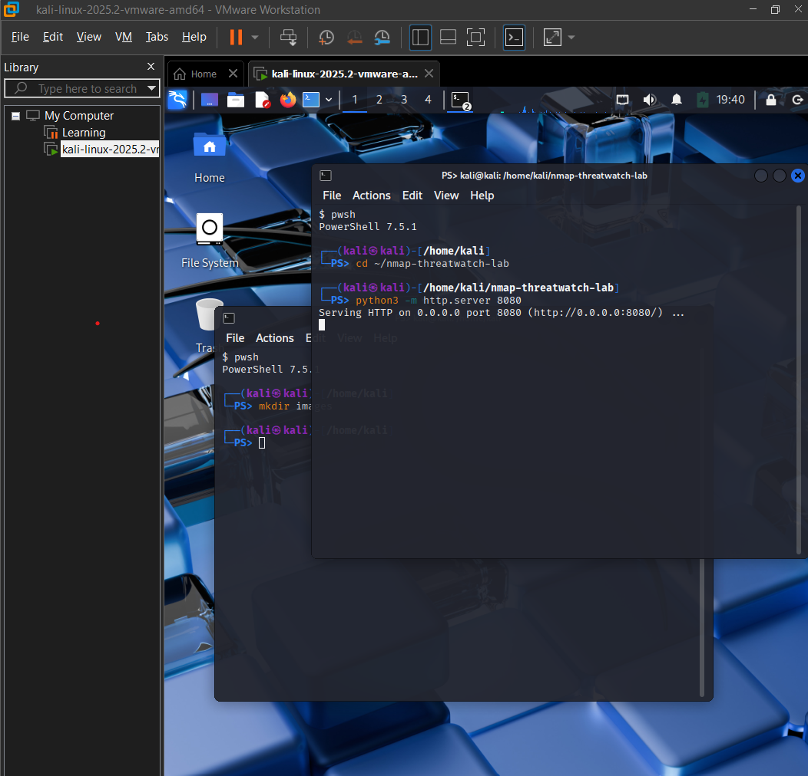
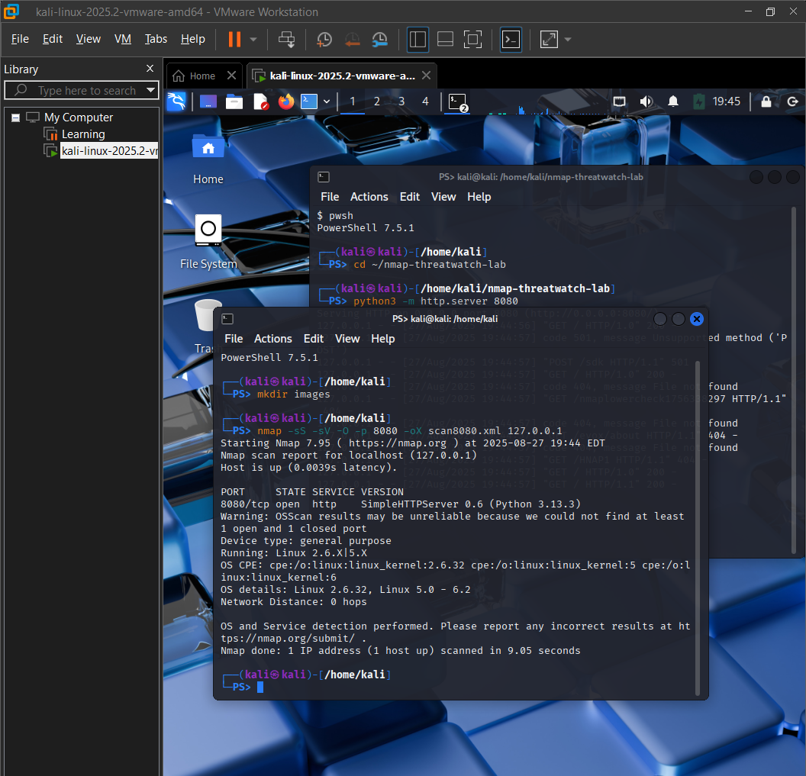
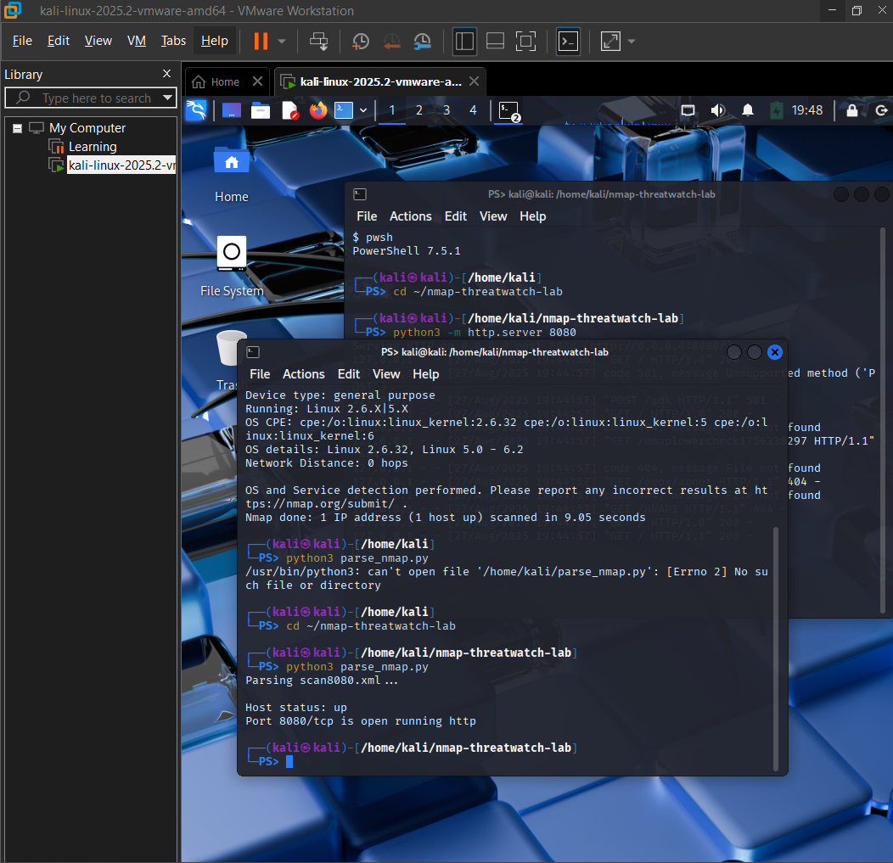

## 📌 Project Summary

This lab showcases a hands-on cybersecurity workflow using Nmap and Python to simulate real-world threat detection. It features a custom XML parser that extracts scan data, maps services to CVSS scores and CVEs, and flags unmatched services for future analysis. Designed for reproducibility, documentation clarity, and portfolio impact.

# nmap-threatwatch-lab
Python-based Nmap lab for port scanning, service detection, and XML parsing. Built for Security+ learning, ThreatWatch integration, and portfolio impact.

This lab simulates a basic threat detection workflow using Nmap and Python. It scans a live HTTP service, parses the XML output, and extracts host status, port state, and service information. The goal is to build a reproducible, recruiter-ready cybersecurity project.

## 🖥️ Environment

This lab was built and tested using:

## 🛠️ Tools Used

- Kali Linux (VM on VMware Workstation)
- Python 3.11
- Nmap 7.95
- Localhost target (127.0.0.1)

## 🔧 Lab Workflow

1. Start a Python HTTP server on port 8080

2. Run an Nmap scan and save output to XML

Command Broken Down: nmap -sS -sV -O -p 8080 -oX scan8080.xml 127.0.0.1

nmap: Lanches the Nmap tool
-sV: Enables Service Verison Detection - identifies the software and version running on the port
-O: OS detection – attempts to fingerprint the operating system
-p 8080: Port specification – limits the scan to port 8080 (where your Python HTTP server is running)
-oX scan8080.xml: Output to XML – saves the scan results in XML format for parsing
127.0.0.1 Target IP – scans the localhost (your Kali VM itself)

📁 Why This Scan Is Useful
- Targets a live service you control (Python HTTP server)
- Produces structured XML output for your parser
- Simulates a real-world threat detection workflow
- Keeps the scope tight and reproducible for documentation

3. Parse the XML using Python to extract:

Command: cd ~/nmap-threatwatch-lab
🧠 Why This Step Matters
• 	Ensures the HTTP server serves content from your lab directory
• 	Allows Python scripts to locate scan files and output folders
• 	Keeps your workflow organized and reproducible

Command parse_nmap.py 

🧠 What parse_nmap.py Actually Does
- Opens the Nmap XML file
It reads scan8080.xml (or whatever file is hardcoded or passed in) to access the scan results.
- Parses the XML structure
It uses a module like xml.etree.ElementTree to extract key data from the scan:
- Host status (e.g., up/down)
- Port number and protocol (e.g., 8080/tcp)
- Service name and version (e.g., http, Python HTTP server)
- Prints the results to the terminal

   - Host status
   - Port number and protocol
   - Service name and version
5. Display results in terminal

----------------------------------------------------------------------------------------------------------------------

### Sample Output:
Parsing scan8080.xml...
Host status: up
Port 8080/tcp is open running http
→ CVSS Score: 8.2 (High) – CVE-2022-12345
Unmatched services:
- fakeService123

## 🚀 How to Run

1. Start the HTTP server:
   (Bash)
   python3 -m http.server 8080

2. Run the Nmap scan:
  (Bash)
  nmap -sS -sV -O -p 8080 -oX scan8080.xml 127.0.0.1

3. Parse the results:
  python3 parse_nmap.py scan8080.xml

4. Review CVSS scoring and unmatched services in the terminal.

 🎯 Why This Lab Matters

- Demonstrates hands-on cybersecurity skills
- Shows ability to automate threat detection workflows
- Highlights XML parsing, CVSS scoring, and service fingerprinting
- Built with reproducibility and documentation in mind

## 📄 License

This project is licensed under the MIT License. See the [LICENSE](LICENSE) file for details.

