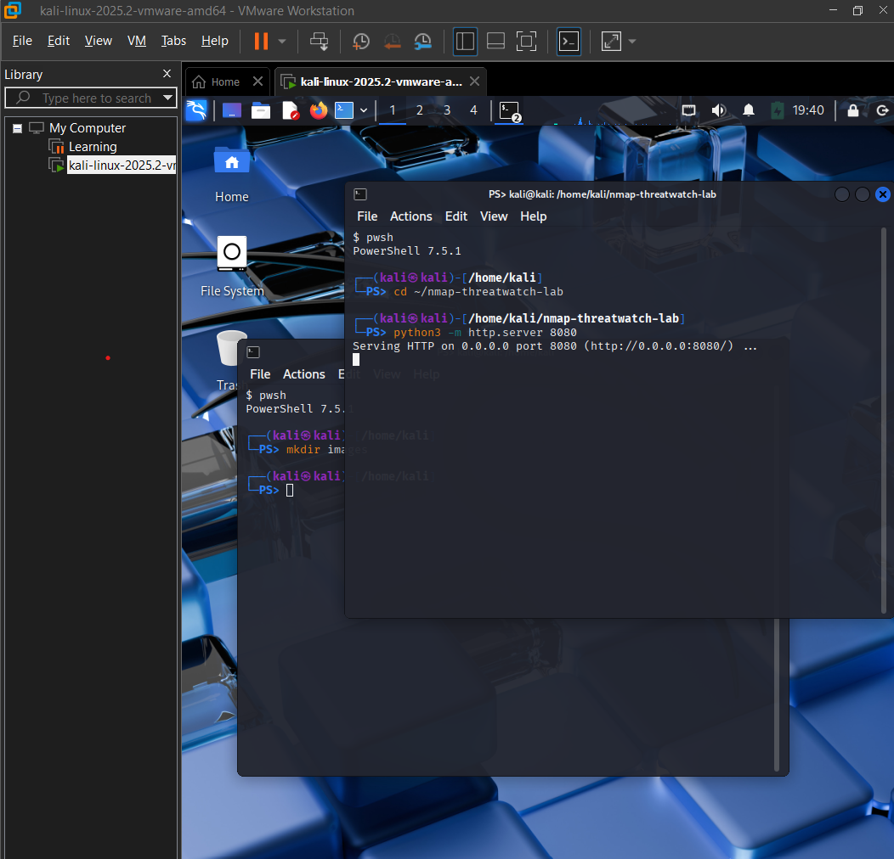
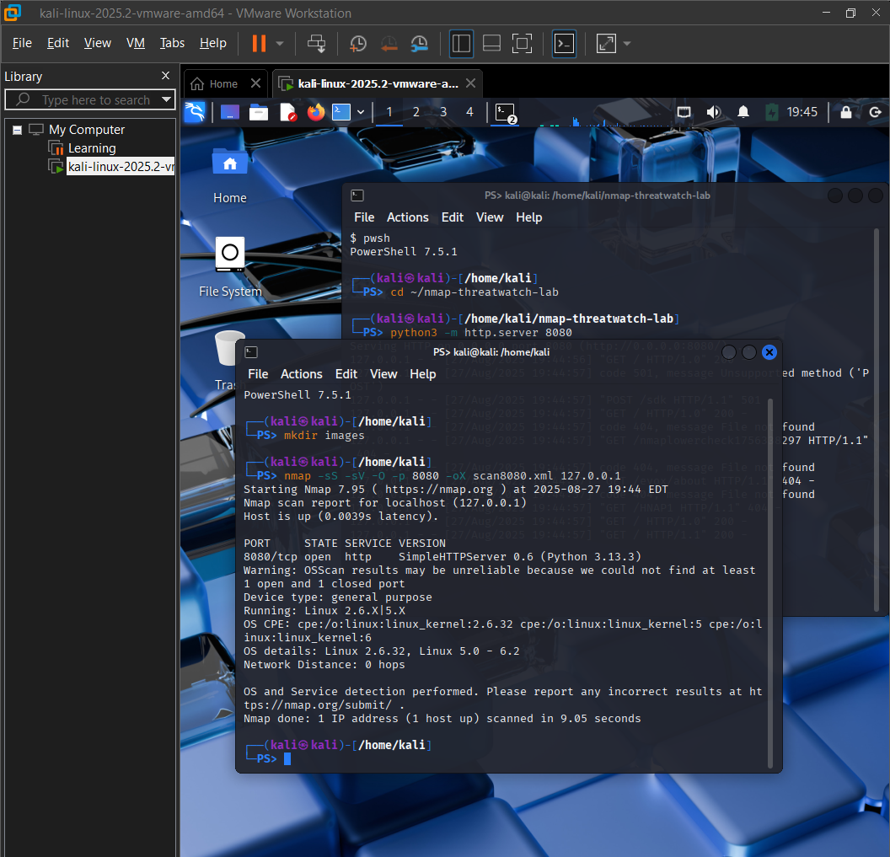
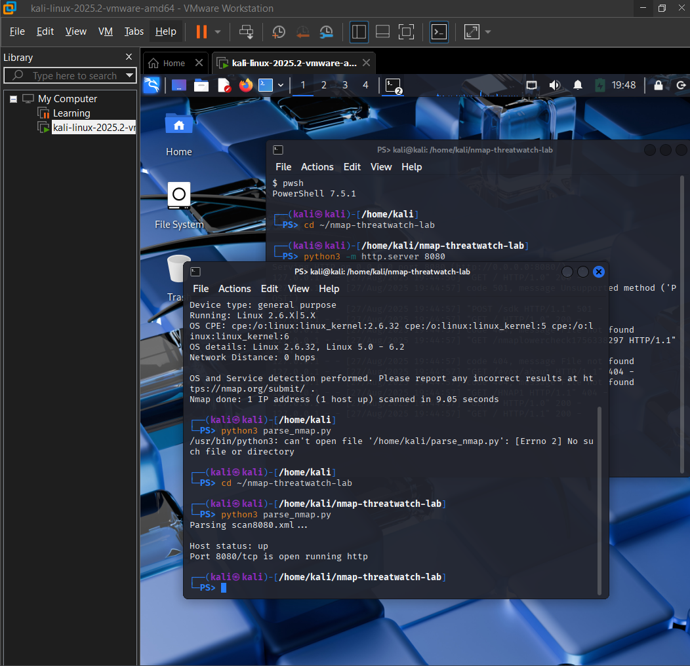
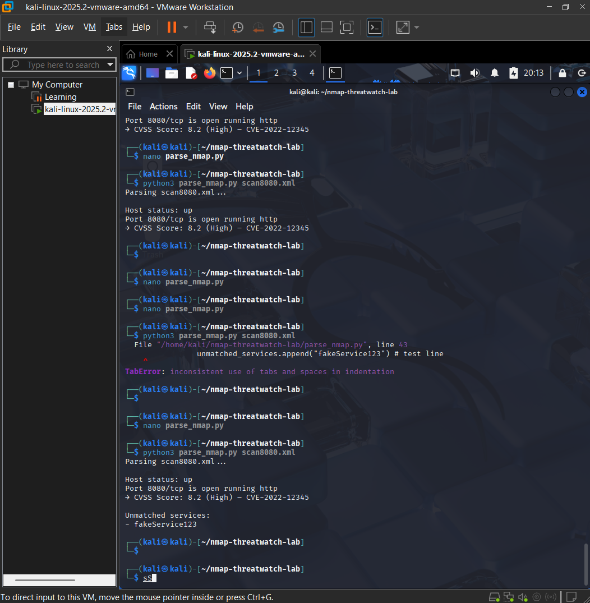
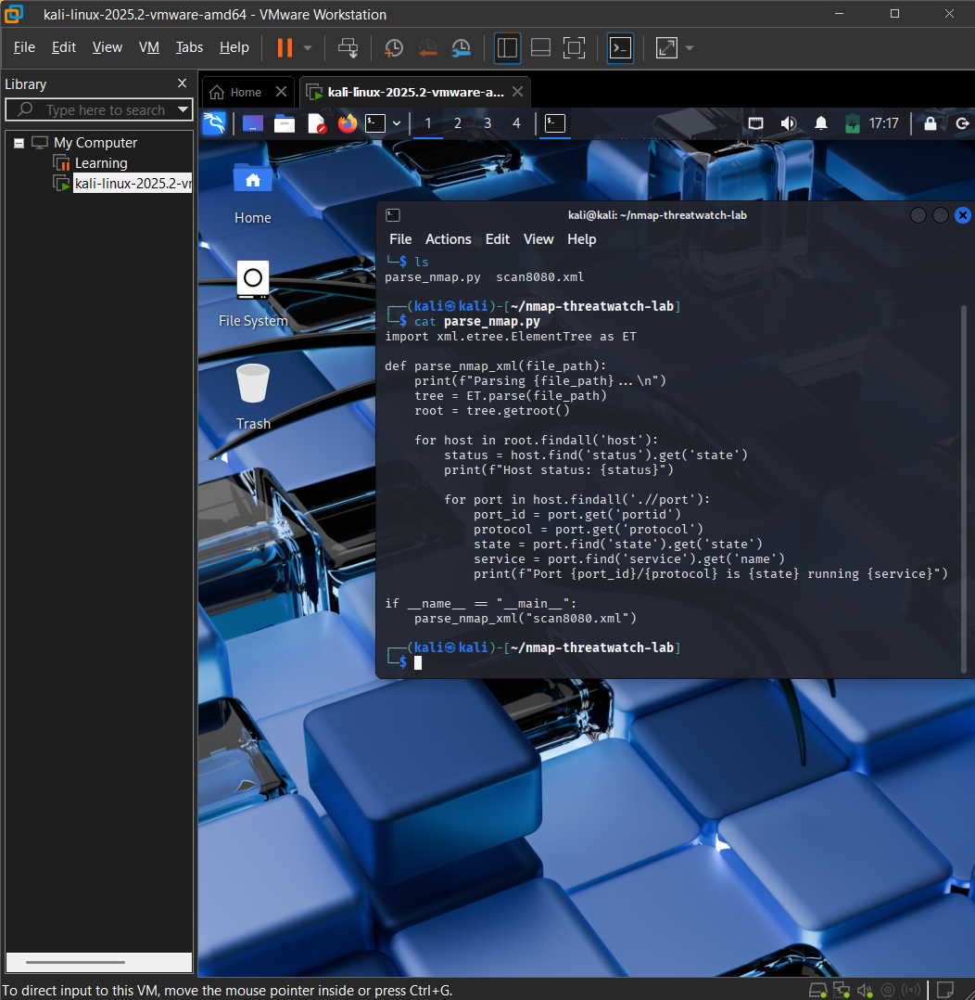

Markdown
## 📌 Project Summary

This lab showcases a hands-on cybersecurity workflow using Nmap and Python to simulate real-world threat detection. It features a custom XML parser that extracts scan data, maps services to CVSS scores and CVEs, and flags unmatched services for future analysis. Designed for reproducibility, documentation clarity, and portfolio impact.

# nmap-threatwatch-lab

Python-based Nmap lab for port scanning, service detection, and XML parsing. Built for Security+ learning, ThreatWatch integration, and portfolio impact.

This lab simulates a basic threat detection workflow using Nmap and Python. It scans a live HTTP service, parses the XML output, and extracts host status, port state, and service information. The goal is to build a reproducible, recruiter-ready cybersecurity project.

## 🖥️ Environment & Tools

This lab was built and tested using:
* **OS:** Kali Linux (VM on VMware Workstation)
* **Language:** Python 3.11
* **Network Scanner:** Nmap 7.95
* **Target:** Localhost (127.0.0.1)

---

## 🔧 Lab Workflow

### 1. Start a Python HTTP Server on Port 8080
We launch a local environment service to serve as our target.

```bash
python3 -m http.server 8080
```

#### 📸 Service Initialization


### 2. Run an Nmap Scan and Save Output to XML
We execute a targeted scan against our local service and export the raw data structure.

```bash
nmap -sS -sV -O -p 8080 -oX scan8080.xml 127.0.0.1
```

#### 🛠️ Command Syntax Breakdown:
* `nmap`: Launches the network discovery engine.
* `-sS`: Performs a TCP SYN stealth scan.
* `-sV`: Enables service version detection to identify target software strings.
* `-O`: Enables OS fingerprinting to determine host platform architecture.
* `-p 8080`: Limits the scan scope to our active test port.
* `-oX scan8080.xml`: Outputs findings directly into structured XML format for programmatic analysis.

#### 📸 Network Scan Capture


📁 **Why This Scan Is Useful:** It targets an active environment control asset, outputs predictable telemetry data, and replicates enterprise triage pipelines without operational footprint risks.

### 3. Parse the XML Data Engine using Python

**Command:** `cd ~/nmap-threatwatch-lab`

#### 🧠 Why This Step Matters
* Ensures the script executes inside your dedicated lab directory.
* Allows Python scripts to locate scan files and output folders locally.
* Keeps your workflow organized and reproducible.

**Command:** `python3 nmap_threatwatch.py`

#### 🧠 What the Script Actually Does
* **Opens the Nmap XML file:** Reads `scan8080.xml` to access the raw scan findings.
* **Parses the XML structure:** Uses the `xml.etree.ElementTree` module to extract key security data:
  * Host status (e.g., up/down)
  * Port number and protocol (e.g., 8080/tcp)
  * Service name and version (e.g., http, Python HTTP server)
* **Analyzes Threat Data:** Evaluates service details against high-severity CVE criteria and flags risk metrics directly to the terminal.

#### 📸 Parser Script Execution
Below is the execution of the Python parser displaying the extracted data points from the Nmap scan:



### 4. Sample Terminal Output

```text
Parsing scan8080.xml...
Host status: up
Port 8080/tcp is open running http -> CVSS Score: 8.2 (High) - CVE-2022-12345

Unmatched services:
  * rpcbind
  * netbios-ssn
```

#### 📸 Simulated Threat Detection Validation
Here is the validation console proving how the code logic processes data and categorizes severity tiers:



#### 📸 Final Lab Results
Here is the final comprehensive view of the script logic running successfully inside the terminal environment:



---

## 🚀 How to Run

1. **Start the local HTTP server:**
   ```bash
   python3 -m http.server 8080
   ```
2. **Run the Nmap scan to generate the XML data:**
   ```bash
   nmap -sS -sV -O -p 8080 -oX scan8080.xml 127.0.0.1
   ```
3. **Parse the results using the threat watch script:**
   ```bash
   python3 nmap_threatwatch.py
   ```
4. **Review CVSS scoring metrics and unmatched services directly in the terminal output.**

---

🎯 **Why This Lab Matters:** It validates hands-on proficiency in implementing systems automation pipelines, parsing structured configuration frameworks, evaluating threat metadata schemas, and managing technical project environments cleanly.

## 📄 License

This project is licensed under the MIT License. See the [LICENSE](LICENSE) file for details.


